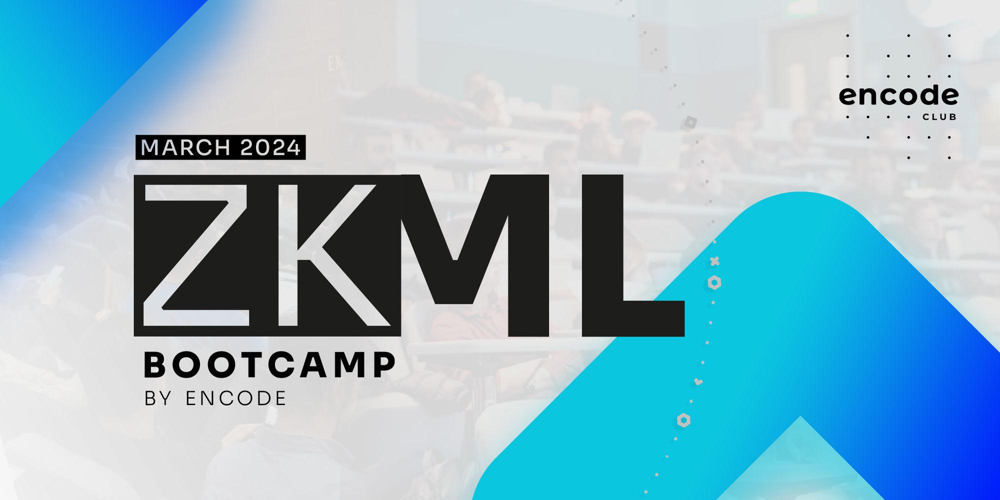

# zkMLBootcampQ1

Advanced bootcamp focused exclusively on Zero Knowledge Machine Learning. Taught by the fantastic team at Extropy.io, covers the way machine learning has recently been influencing cryptography and its applications in blockchain.

> ###### [Hacker pack](https://encodeclub.notion.site/zkML-Bootcamp-Q1-2024-56797105136243a5b60d0cd509a13bf6)
>
> ###### [Slido](https://app.sli.do/event/erR9KGe8wQgsocRxxmpdjw)
>
> ###### [Discord](https://discord.gg/encodeclub)

## 

## [Extropy.io](https://www.linkedin.com/company/extropy-io-ltd/)

[**Laurence Kirk**](https://www.linkedin.com/in/extropylaurence/) _teacher_

[_Meek Msaki_](https://www.linkedin.com/in/msaki/) _assitant_

### Guests

[_Andrei Stolan_/**Zama**](https://www.linkedin.com/in/andreistoian/)

[_dcbuilder_/**Worldcoin**](https://twitter.com/DCbuild3r)

[_jseam_/**ezki**](https://www.linkedin.com/in/jason-m-6147221/) ✔️

[_Lance Davis_/**Gizatech**](https://www.linkedin.com/in/lancendavis/)

[_Ryan Cao_/**Modulus**](https://www.linkedin.com/in/ryan-cao/)

[_Tomer Solberg_/**Ingonyama**](https://www.linkedin.com/in/tomer-solberg-a319a03/)

## Videos

First week ✔️

> [class 1](./class1)
> > 25 Mar [Fundamentals of ZKP and ML](https://youtu.be/1gkTFRL_asc)

> [class 2](./class2)
> > 26 Mar [Introduction to ML](https://youtu.be/y_Nl5PF8vX0)

> [class 3](./class3)
> > 27 Mar [Intro to zkML/Use cases](https://youtu.be/SnYBN3y3mp4)

> [class 4](./class4)
> > 28 Mar [EZKL workshop](https://youtu.be/2FWQvj4-3aw)

Second week 

> [class 5](./class5)
> > 2 Apr 

> [class 6](./class6)
> > 3 Apr 

> [class 7](./class7)
> > 4 Apr 

